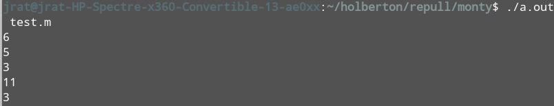

# Stacks, Queues - LIFO, FIFO



## Monty

A project for [Holberton School](https://www.holbertonschool.com/), this is an interpreter for Monty bytecodes files. [Monty](http://montyscoconut.github.io/) is a scripting language that is first compiled into Monty byte codes. It relies on a unique stack data structure with specific instructions to manipulate it. Monty byte codes usually have the `.m` extension. 

---

### Requirements

- Ubuntu 14.04 LTS
- all `.c` files pass [`Betty`](https://github.com/holbertonschool/Betty) style: [betty-style.pl](https://github.com/holbertonschool/Betty/blob/master/betty-style.pl) and [betty-doc.pl](https://github.com/holbertonschool/Betty/blob/master/betty-doc.pl)
- maximum of one global variable
- no more than 5 functions per file
- prototypes of all functions are included in header file called `monty.h`
- all header files are include guarded
- allowed to use standard library

### Compilation

The files are to be compiled this way:

```
$ gcc -Wall -Werror -Wextra -pedantic *.c -o monty
```

### How to use

1. compile files
2. `$ ./a.out monty_byte_code_file_name.m`

A few Monty bytecode files are supplied in the `byecodes` directory. For supported opcodes, look below.


### Example of usage

```
$ cat test.m
push 3
push 5
push 6
pall
add
pall
$ ./a.out test.m
6
5
3
11
3
```

---

### [push](./pushpallpint.c)

    Usage: `push <int>` where `<int>` is an integer

    What it does: pushes an element to the stack.

### [pall](./pushpallpint.c)

    Usage: `pall`

    What it does: prints all the values on the stack, starting from the top of the stack.

### [pint](./pushpallpint.c)

    Usage: `pint`

    What it does: prints the value at the top of the stack followed by a new line.

### [pop](./noppopswap.c)

    Usage: `pop`

    What it does: removes the top element of the stack.

### [swap](./noppopswap.c)

    Usage: `swap`

    What it does: swaps the top two elements of the stack.

### [add](./arithmetic.c)

    Usage: `add`

    What it does: adds the top two elements of the stack. The answer is stored in the second top element of the stack and the top element is removed so that the top element contains the result and the stack is one element shorter.


## [sub](./arithmetic.c)

    Usage: `sub` 

    What it does: subtracts the top element of the stack from the second element of the stack. The answer is stored in the second top element of the stack and the top element is removed so that the top element contains the result and the stack is one element shorter.

### [div](./arithmetic.c)

Usage: `div`

What it does: divides the second top element of the stack by the first element of the stack. The answer is stored in the second top element of the stack and the top element is removed so that the top element contains the result and the stack is one element shorter.

### [mul](./arithmetic.c)

Usage: `mul`

What it does: multiplies the top two elements of the stack. The answer is stored in the second top element of the stack and the top element is removed so that the top element contains the result and the stack is one element shorter.

## [mod](./arithmetic.c)

    Usage: `mod`

    What it does: computes the remainder of the division of the second top element of the stack by the top element of the stack. The answer is stored in the second top element of the stack and the top element is removed so that the top element contains the result and the stack is one element shorter.

---

## Author

* **Rory Fahy** - [rmf10003](https://github.com/rmf10003)
* **Jared Ratner** - [OrangeB0lt](https://github.com/OrangeB0lt)
